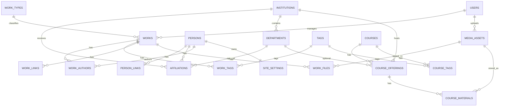

# Especificación de Ingeniería de Requerimientos
## Plataforma Académica Personal — Backend, Base de Datos y Panel Administrativo

**Versión:** 1.0  
**Estado:** Propuesta para implementación  
**Objetivo del documento:** servir como especificación funcional y técnica para que un agente de IA/backend pueda implementar el sistema sin depender de Strapi.  
**Alcance público del MVP:** exactamente 3 páginas: **Home**, **Research** y **Teaching**.  
**Alcance administrativo:** panel privado para administrar todo el contenido visible en esas 3 páginas.

---

# 1. Objetivo del sistema

Construir una aplicación web académica personal para un profesor/investigador que permita:

1. Mostrar su perfil profesional.
2. Mostrar toda su producción académica:
   - journal articles;
   - books;
   - book chapters;
   - working papers;
   - work in progress;
   - conference papers;
   - reports;
   - datasets/software u otros trabajos.
3. Mostrar su actividad docente:
   - cursos;
   - distintas ediciones/instancias del mismo curso;
   - institución/departamento donde se impartió;
   - materiales descargables;
   - periodos y estado activo.
4. Permitir que el académico gestione todo ese contenido desde un panel administrativo.
5. Evitar un CMS genérico con decenas de tipos de contenido y relaciones difíciles de mantener.
6. Mantener el dominio de datos simple, normalizado y orientado específicamente a un **portfolio académico**.

El sistema será diseñado inicialmente para **una sola persona académica**, pero el modelo de datos no debe impedir una futura evolución a múltiples perfiles.

---

# 2. Principios de diseño

## 2.1. Tres páginas públicas

El MVP tendrá únicamente:

```text
/
 /research
 /teaching
```

No se requieren páginas públicas independientes para cada paper o curso en el MVP.

Los detalles de un trabajo o curso pueden mostrarse en:

- expansión de card;
- modal;
- drawer;
- sección desplegable;
- anchor dentro de la misma página.

> Nota de arquitectura: el backend debe generar `slug` estable para trabajos y cursos aunque inicialmente no exista una ruta pública individual. Esto permitirá crear páginas individuales más adelante sin migrar la base de datos.

---

## 2.2. El contenido no debe estar hardcodeado

Todo texto que forme parte del contenido académico debe ser editable desde administración.

No se deben hardcodear en el frontend:

- nombre;
- biografía;
- afiliación;
- introducción a Research;
- introducción a Teaching;
- publicaciones;
- cursos;
- redes;
- CV;
- links;
- imágenes;
- textos de secciones.

Se permite hardcodear únicamente:

- estructura visual;
- etiquetas estándar de UI;
- componentes;
- comportamiento de filtros;
- layout.

---

## 2.3. Separar contenido académico de configuración visual

No mezclar entidades del dominio académico con detalles de presentación.

Ejemplo:

```text
Work
title
abstract
authors
doi
year
status
```

NO debe contener:

```text
button_color
card_background
text_size
```

La presentación debe vivir en frontend o en configuración global limitada.

---

## 2.4. Evitar jerarquías rígidas innecesarias

No modelar:

```text
Institution
  └─ Department
      └─ Course
          └─ CourseInstance
```

como una dependencia obligatoria.

Un **Course** es una entidad académica reutilizable.

La institución y el departamento pertenecen a una **CourseOffering** o edición del curso.

Modelo recomendado:

```text
Course
   ├─ CourseOffering 2024
   │      ├─ Institution
   │      └─ Department
   ├─ CourseOffering 2025
   │      ├─ Institution
   │      └─ Department
   └─ CourseOffering 2026
          ├─ Institution
          └─ Department
```

De esta manera el mismo curso puede impartirse:

- varios años;
- en distintas instituciones;
- en distintos departamentos;
- con diferentes materiales.

---

# 3. Actores

## 3.1. Visitante público

Puede:

- ver Home;
- ver Research;
- buscar trabajos;
- filtrar trabajos;
- abrir detalles;
- descargar archivos públicos;
- abrir DOI/publisher/code/dataset;
- copiar citas;
- ver Teaching;
- buscar cursos;
- filtrar cursos;
- descargar materiales públicos;
- acceder a redes profesionales y CV.

No puede modificar información.

---

## 3.2. Administrador académico

Usuario autenticado.

Puede:

- editar perfil;
- editar textos de las tres páginas;
- crear/editar/publicar/archivar trabajos;
- reordenar trabajos destacados;
- administrar autores;
- administrar tags;
- administrar instituciones;
- administrar departamentos;
- administrar afiliaciones;
- crear/editar cursos;
- crear/editar ediciones de cursos;
- subir archivos;
- cambiar enlaces;
- marcar contenido como destacado;
- cambiar visibilidad;
- cambiar orden;
- administrar configuración general del sitio.

---

# 4. Mapa funcional

```text
PUBLIC
│
├── Home
│   ├── Profile / Hero
│   ├── Academic links
│   ├── About / Research statement breve
│   ├── Selected / Featured Work
│   └── Selected Teaching
│
├── Research
│   ├── Intro
│   ├── Search
│   ├── Filter by work type
│   ├── Filter by status
│   ├── Filter by year
│   ├── Filter by tag
│   └── Works
│       └── Expanded details
│
└── Teaching
    ├── Intro
    ├── Search
    ├── Filter by institution
    ├── Filter by department
    ├── Active only
    └── Courses
        └── Offerings / editions

ADMIN
│
├── Dashboard
├── Profile
├── Page Content
├── Works
├── Authors / People
├── Tags
├── Institutions
├── Departments
├── Affiliations
├── Courses
├── Course Offerings
├── Media
├── Site Settings
└── Audit Log
```

---

# 5. Requerimientos funcionales

## RF-001 — Perfil académico

El sistema debe permitir almacenar y mostrar:

- nombre completo;
- nombre corto;
- título profesional;
- cargo actual;
- institución principal;
- departamento principal;
- ciudad/país;
- email público;
- biografía corta;
- biografía extendida;
- research statement;
- foto;
- CV;
- ORCID;
- Google Scholar;
- Scopus;
- SSRN;
- RePEc;
- GitHub;
- LinkedIn;
- web personal adicional;
- otros enlaces configurables.

---

## RF-002 — Producción académica unificada

Todos los trabajos académicos deben almacenarse en una única entidad `works`.

No crear tablas independientes como:

```text
journal_articles
working_papers
books
work_in_progress
```

El tipo se representará mediante `work_type`.

Esto evita duplicar:

- título;
- autores;
- abstract;
- archivos;
- tags;
- links;
- fechas;
- lógica de búsqueda.

---

## RF-003 — Tipos de trabajo

Tipos soportados inicialmente:

```text
journal_article
working_paper
work_in_progress
book
book_chapter
conference_paper
policy_report
research_note
thesis
dataset
software
other
```

El backend debe permitir añadir nuevos tipos sin modificar la estructura principal de `works`.

---

## RF-004 — Estado académico del trabajo

Estados académicos soportados:

```text
published
forthcoming
accepted
revise_and_resubmit
under_review
working_paper
work_in_progress
inactive
```

Este estado NO debe confundirse con el estado editorial del CMS.

---

## RF-005 — Estado editorial del contenido

Toda entidad publicable debe poseer:

```text
draft
published
archived
```

Solo `published` será visible públicamente.

---

## RF-006 — Autores

Un trabajo puede tener uno o muchos autores.

Debe mantenerse:

- orden de autoría;
- persona;
- rol opcional.

El propietario del sitio también debe existir en la tabla `persons`.

No guardar los autores como un string tipo:

```text
"Juan Carlos Carbajal, Rudolf Müller"
```

---

## RF-007 — Keywords / Tags

Los trabajos y cursos pueden tener múltiples tags.

Los tags se gestionan centralmente para evitar:

```text
Behavioral Economics
behavioral economics
Behavioral economics
```

como tres valores distintos.

---

## RF-008 — Links de un trabajo

Un trabajo puede tener cero o muchos links.

Tipos sugeridos:

```text
doi
publisher
pdf_external
code
dataset
replication
slides
video
project
preprint
supplementary
other
```

---

## RF-009 — Archivos de un trabajo

Un trabajo puede tener múltiples archivos.

Tipos:

```text
paper_pdf
appendix
supplement
code_archive
data_archive
slides
poster
cover
figure
other
```

Cada archivo puede ser público o privado.

---

## RF-010 — Citas

El sistema debe poder generar automáticamente:

- texto de cita;
- BibTeX.

La generación debe utilizar los metadatos del trabajo.

Opcionalmente el administrador puede almacenar:

- `citation_text_override`;
- `bibtex_override`.

Si existe un override, tiene prioridad sobre la generación automática.

---

## RF-011 — Research

`/research` debe consultar exclusivamente trabajos publicados editorialmente.

Debe permitir filtros combinables por:

- texto;
- tipo;
- estado académico;
- año;
- tags.

La búsqueda textual debe considerar al menos:

- título;
- subtítulo;
- abstract;
- autores;
- venue;
- tags.

---

## RF-012 — Orden de Research

Orden por defecto:

1. `display_order` cuando sea explícito.
2. Después `publication_year DESC`.
3. Después `created_at DESC`.

El frontend puede permitir cambiar entre:

- newest;
- oldest;
- title.

---

## RF-013 — Featured work

Un trabajo puede marcarse:

```text
is_featured = true
```

Los trabajos destacados pueden aparecer en Home.

Debe existir `featured_order`.

---

## RF-014 — Cursos

`Course` representa el concepto general del curso.

Ejemplos:

```text
Intermediate Microeconomics
Advanced Managerial Economics
Game Theory
Microeconomic Theory 1
```

No debe almacenar directamente una universidad o año específico.

---

## RF-015 — Ediciones / Course Offerings

Cada vez que un curso se imparte debe registrarse como `course_offering`.

Ejemplo:

```text
Course:
Intermediate Microeconomics

Offerings:
2024 Semester 1 — UNSW
2025 Semester 1 — UNSW
2026 Semester 1 — University X
```

---

## RF-016 — Estado activo de docencia

`course_offering.is_active` indicará si esa edición está actualmente vigente.

La página Teaching podrá tener filtro:

```text
Only active
```

---

## RF-017 — Instituciones y departamentos

Una institución puede tener múltiples departamentos.

Un departamento pertenece a una institución.

Pero un curso NO pertenece directamente al departamento.

La relación correcta es:

```text
course_offering → institution
course_offering → department (optional)
```

---

## RF-018 — Afiliaciones profesionales

Las afiliaciones de la persona se almacenarán independientemente de los cursos.

Ejemplos:

- Professor, UNSW, School of Economics;
- Visiting Scholar, University X;
- Research Fellow, Institute Y.

Esto evita utilizar cursos o instituciones docentes para inferir el perfil profesional.

---

## RF-019 — Página Teaching

`/teaching` debe mostrar:

- intro editable;
- filtros;
- cursos;
- ediciones relevantes;
- materiales disponibles.

Filtros:

- texto;
- institución;
- departamento;
- active only.

---

## RF-020 — Home

La Home debe contener como mínimo:

1. Hero/Profile.
2. About/research statement breve.
3. Featured work.
4. Featured teaching.
5. Links académicos.

No debe implementarse un page-builder genérico en el MVP.

El administrador podrá:

- editar textos;
- activar/desactivar bloques;
- seleccionar featured works;
- seleccionar featured courses;
- cambiar orden de elementos destacados.

---

# 6. Modelo de datos

Base de datos recomendada:

```text
PostgreSQL
```

Convenciones:

- IDs: UUID.
- timestamps: `timestamptz`.
- nombres de tablas: `snake_case`.
- soft delete solo donde sea necesario.
- todos los timestamps en UTC.
- URLs completas.
- archivos almacenados fuera de PostgreSQL.

---

# 7. Tabla `users`

Usuarios del panel administrativo.

| Campo | Tipo | Null | Default | Descripción |
|---|---|---:|---|---|
| id | uuid PK | no | gen_random_uuid() | ID |
| email | varchar(320) unique | no | | email login |
| password_hash | text | no | | hash seguro |
| display_name | varchar(150) | no | | nombre del admin |
| role | varchar(30) | no | `admin` | rol |
| is_active | boolean | no | true | acceso habilitado |
| last_login_at | timestamptz | sí | | último login |
| created_at | timestamptz | no | now() | creación |
| updated_at | timestamptz | no | now() | actualización |

Validaciones:

- email normalizado a lowercase;
- nunca almacenar password plano;
- password mínimo definido por política de seguridad.

---

# 8. Tabla `persons`

Personas académicas: propietario del sitio y coautores.

| Campo | Tipo | Null | Descripción |
|---|---|---:|---|
| id | uuid PK | no | ID |
| is_site_owner | boolean | no | identifica al académico principal |
| full_name | varchar(200) | no | nombre |
| given_name | varchar(100) | sí | nombres |
| family_name | varchar(100) | sí | apellidos |
| preferred_name | varchar(150) | sí | nombre visible alternativo |
| professional_title | varchar(200) | sí | Professor, Economist, etc. |
| current_position | varchar(250) | sí | cargo actual |
| public_email | varchar(320) | sí | email público |
| phone | varchar(50) | sí | opcional; normalmente no visible |
| city | varchar(120) | sí | ciudad |
| country_code | char(2) | sí | ISO-3166 alpha-2 |
| short_bio | text | sí | resumen para Home |
| full_bio_markdown | text | sí | bio extendida |
| research_statement_markdown | text | sí | research statement |
| photo_media_id | uuid FK media_assets | sí | foto |
| cv_media_id | uuid FK media_assets | sí | CV |
| orcid | varchar(40) | sí | ORCID |
| google_scholar_url | text | sí | Scholar |
| scopus_url | text | sí | Scopus |
| ssrn_url | text | sí | SSRN |
| repec_url | text | sí | RePEc |
| website_url | text | sí | web |
| sort_name | varchar(200) | sí | para orden alfabético |
| created_at | timestamptz | no | |
| updated_at | timestamptz | no | |

Restricción recomendada:

```text
solo una persona puede tener is_site_owner = true
```

---

# 9. Tabla `person_links`

Links adicionales de una persona.

| Campo | Tipo | Null | Descripción |
|---|---|---:|---|
| id | uuid PK | no | ID |
| person_id | uuid FK persons | no | persona |
| link_type | varchar(50) | no | linkedin/github/bluesky/etc. |
| label | varchar(100) | sí | texto visible |
| url | text | no | URL |
| icon_key | varchar(50) | sí | nombre lógico de icono |
| is_public | boolean | no | mostrar |
| sort_order | integer | no | orden |
| created_at | timestamptz | no | |
| updated_at | timestamptz | no | |

Unique sugerido:

```text
(person_id, link_type, url)
```

---

# 10. Tabla `media_assets`

Registro de archivos subidos.

El binario debe estar en almacenamiento tipo:

- S3;
- Cloudflare R2;
- MinIO;
- almacenamiento equivalente.

| Campo | Tipo | Null | Descripción |
|---|---|---:|---|
| id | uuid PK | no | ID |
| storage_key | text unique | no | key del objeto |
| public_url | text | sí | URL pública |
| original_filename | text | no | nombre original |
| mime_type | varchar(150) | no | MIME |
| size_bytes | bigint | no | tamaño |
| checksum_sha256 | char(64) | sí | integridad/dedupe |
| alt_text | text | sí | accesibilidad |
| caption | text | sí | pie |
| credit | text | sí | atribución |
| is_public | boolean | no | acceso |
| uploaded_by | uuid FK users | sí | admin |
| created_at | timestamptz | no | |

No guardar archivos binarios directamente en PostgreSQL.

---

# 11. Tabla `institutions`

| Campo | Tipo | Null | Descripción |
|---|---|---:|---|
| id | uuid PK | no | ID |
| name | varchar(250) | no | nombre completo |
| short_name | varchar(100) | sí | UNSW, MIT, etc. |
| slug | varchar(180) unique | no | identificador estable |
| website_url | text | sí | web |
| country_code | char(2) | sí | país |
| city | varchar(120) | sí | ciudad |
| logo_media_id | uuid FK media_assets | sí | logo |
| description | text | sí | opcional |
| is_active | boolean | no | activo |
| created_at | timestamptz | no | |
| updated_at | timestamptz | no | |

---

# 12. Tabla `departments`

| Campo | Tipo | Null | Descripción |
|---|---|---:|---|
| id | uuid PK | no | ID |
| institution_id | uuid FK institutions | no | institución |
| name | varchar(250) | no | departamento/facultad |
| short_name | varchar(120) | sí | abreviación |
| slug | varchar(180) | no | slug dentro de institución |
| website_url | text | sí | web |
| is_active | boolean | no | activo |
| created_at | timestamptz | no | |
| updated_at | timestamptz | no | |

Unique:

```text
(institution_id, slug)
```

---

# 13. Tabla `affiliations`

Historial de cargos/afiliaciones de una persona.

| Campo | Tipo | Null | Descripción |
|---|---|---:|---|
| id | uuid PK | no | ID |
| person_id | uuid FK persons | no | persona |
| institution_id | uuid FK institutions | no | institución |
| department_id | uuid FK departments | sí | departamento |
| title | varchar(250) | no | cargo |
| affiliation_type | varchar(50) | sí | faculty/fellow/visitor/etc. |
| start_date | date | sí | inicio |
| end_date | date | sí | fin |
| is_primary | boolean | no | afiliación principal |
| is_current | boolean | no | vigente |
| description_markdown | text | sí | información |
| sort_order | integer | no | orden |
| created_at | timestamptz | no | |
| updated_at | timestamptz | no | |

Regla:

- si `department_id` no es null, debe pertenecer a `institution_id`.

---

# 14. Tabla `work_types`

Catálogo extensible.

| Campo | Tipo | Null | Descripción |
|---|---|---:|---|
| id | uuid PK | no | ID |
| code | varchar(50) unique | no | journal_article, book... |
| label | varchar(100) | no | etiqueta UI |
| plural_label | varchar(120) | no | Journal Articles |
| sort_order | integer | no | orden de grupo |
| is_active | boolean | no | disponible |
| created_at | timestamptz | no | |
| updated_at | timestamptz | no | |

Valores seed:

```text
journal_article
working_paper
work_in_progress
book
book_chapter
conference_paper
policy_report
research_note
thesis
dataset
software
other
```

---

# 15. Tabla `works`

Entidad principal de producción académica.

| Campo | Tipo | Null | Descripción |
|---|---|---:|---|
| id | uuid PK | no | ID |
| work_type_id | uuid FK work_types | no | tipo |
| title | text | no | título |
| subtitle | text | sí | subtítulo |
| slug | varchar(260) unique | no | slug estable/futuro |
| abstract_markdown | text | sí | abstract |
| description_markdown | text | sí | descripción adicional |
| academic_status | varchar(50) | no | published/working_paper/etc. |
| editorial_status | varchar(20) | no | draft/published/archived |
| publication_date | date | sí | fecha exacta si existe |
| publication_year | smallint | sí | año |
| first_online_date | date | sí | publicación online |
| venue_name | varchar(300) | sí | journal/conference/serie |
| publisher_name | varchar(300) | sí | publisher |
| volume | varchar(50) | sí | volumen |
| issue | varchar(50) | sí | número |
| pages | varchar(50) | sí | ej. 120-141 |
| article_number | varchar(100) | sí | article ID |
| doi | varchar(255) | sí | DOI sin URL preferentemente |
| isbn | varchar(50) | sí | libro |
| issn | varchar(50) | sí | journal |
| language_code | varchar(10) | sí | ISO |
| cover_media_id | uuid FK media_assets | sí | portada |
| citation_text_override | text | sí | cita manual |
| bibtex_override | text | sí | BibTeX manual |
| is_featured | boolean | no | Home |
| featured_order | integer | sí | orden Home |
| display_order | integer | sí | orden manual Research |
| is_open_access | boolean | no | full-text disponible |
| published_at | timestamptz | sí | fecha editorial |
| created_by | uuid FK users | sí | admin |
| updated_by | uuid FK users | sí | admin |
| created_at | timestamptz | no | |
| updated_at | timestamptz | no | |
| archived_at | timestamptz | sí | |

Validaciones:

- `publication_year` entre 1800 y año actual + 5;
- DOI normalizado sin `https://doi.org/`;
- `published_at` requerido cuando `editorial_status = published`;
- `featured_order` solo relevante si `is_featured = true`.

Índices:

```text
(editorial_status)
(work_type_id)
(academic_status)
(publication_year DESC)
(is_featured, featured_order)
LOWER(title)
```

Búsqueda full-text recomendada sobre:

```text
title
subtitle
abstract_markdown
venue_name
publisher_name
```

---

# 16. Tabla `work_authors`

Relación many-to-many entre works y persons.

| Campo | Tipo | Null | Descripción |
|---|---|---:|---|
| work_id | uuid FK works | no | trabajo |
| person_id | uuid FK persons | no | autor |
| author_order | integer | no | orden 1..N |
| contribution_role | varchar(80) | sí | author/editor/etc. |
| is_corresponding | boolean | no | corresponding author |
| created_at | timestamptz | no | |

PK/Unique:

```text
PRIMARY KEY (work_id, person_id)
UNIQUE (work_id, author_order)
```

---

# 17. Tabla `tags`

Taxonomía unificada.

| Campo | Tipo | Null | Descripción |
|---|---|---:|---|
| id | uuid PK | no | ID |
| name | varchar(120) | no | etiqueta |
| slug | varchar(140) unique | no | slug |
| category | varchar(50) | sí | field/method/topic/etc. |
| sort_order | integer | no | orden |
| is_active | boolean | no | activo |
| created_at | timestamptz | no | |
| updated_at | timestamptz | no | |

Ejemplos:

```text
Microeconomic Theory
Mechanism Design
Behavioral Economics
Auctions
Political Economy
Revenue Equivalence
Dynamic Models
```

---

# 18. Tabla `work_tags`

| Campo | Tipo | Null |
|---|---|---:|
| work_id | uuid FK works | no |
| tag_id | uuid FK tags | no |
| created_at | timestamptz | no |

PK:

```text
(work_id, tag_id)
```

---

# 19. Tabla `work_links`

| Campo | Tipo | Null | Descripción |
|---|---|---:|---|
| id | uuid PK | no | ID |
| work_id | uuid FK works | no | trabajo |
| link_type | varchar(50) | no | doi/publisher/code/etc. |
| label | varchar(120) | sí | texto |
| url | text | no | URL |
| sort_order | integer | no | orden |
| is_public | boolean | no | mostrar |
| created_at | timestamptz | no | |
| updated_at | timestamptz | no | |

---

# 20. Tabla `work_files`

| Campo | Tipo | Null | Descripción |
|---|---|---:|---|
| id | uuid PK | no | ID |
| work_id | uuid FK works | no | trabajo |
| media_id | uuid FK media_assets | no | archivo |
| file_type | varchar(50) | no | paper_pdf/appendix/etc. |
| label | varchar(150) | sí | texto |
| version_label | varchar(100) | sí | Accepted manuscript, v2... |
| sort_order | integer | no | orden |
| is_public | boolean | no | descargar |
| created_at | timestamptz | no | |

---

# 21. Tabla `courses`

Concepto general del curso.

| Campo | Tipo | Null | Descripción |
|---|---|---:|---|
| id | uuid PK | no | ID |
| title | varchar(300) | no | título |
| short_title | varchar(160) | sí | título corto |
| slug | varchar(220) unique | no | slug |
| default_code | varchar(80) | sí | código base |
| level | varchar(80) | sí | undergraduate/graduate/etc. |
| summary | text | sí | descripción corta |
| description_markdown | text | sí | descripción |
| cover_media_id | uuid FK media_assets | sí | imagen |
| editorial_status | varchar(20) | no | draft/published/archived |
| is_featured | boolean | no | Home |
| featured_order | integer | sí | Home |
| display_order | integer | sí | Teaching |
| published_at | timestamptz | sí | |
| created_by | uuid FK users | sí | |
| updated_by | uuid FK users | sí | |
| created_at | timestamptz | no | |
| updated_at | timestamptz | no | |

Importante:

**NO existen `institution_id` ni `department_id` en esta tabla.**

---

# 22. Tabla `course_tags`

| Campo | Tipo | Null |
|---|---|---:|
| course_id | uuid FK courses | no |
| tag_id | uuid FK tags | no |
| created_at | timestamptz | no |

PK:

```text
(course_id, tag_id)
```

---

# 23. Tabla `course_offerings`

Edición concreta de un curso.

| Campo | Tipo | Null | Descripción |
|---|---|---:|---|
| id | uuid PK | no | ID |
| course_id | uuid FK courses | no | curso |
| institution_id | uuid FK institutions | no | universidad |
| department_id | uuid FK departments | sí | departamento |
| name | varchar(250) | sí | nombre edición |
| course_code | varchar(80) | sí | código específico |
| term | varchar(100) | sí | Semester 1, Fall... |
| academic_year | smallint | sí | año |
| start_date | date | sí | inicio |
| end_date | date | sí | fin |
| teaching_role | varchar(120) | sí | Lecturer/Coordinator/etc. |
| summary | text | sí | descripción corta |
| content_markdown | text | sí | contenido extendido |
| is_active | boolean | no | edición actual |
| editorial_status | varchar(20) | no | draft/published/archived |
| sort_order | integer | sí | orden |
| published_at | timestamptz | sí | |
| created_at | timestamptz | no | |
| updated_at | timestamptz | no | |

Regla:

Si `department_id` no es null, ese departamento debe pertenecer a `institution_id`.

Índices:

```text
(course_id)
(institution_id)
(department_id)
(is_active)
(academic_year DESC)
(editorial_status)
```

---

# 24. Tabla `course_materials`

| Campo | Tipo | Null | Descripción |
|---|---|---:|---|
| id | uuid PK | no | ID |
| course_offering_id | uuid FK course_offerings | no | edición |
| media_id | uuid FK media_assets | sí | archivo interno |
| external_url | text | sí | URL externa |
| material_type | varchar(50) | no | syllabus/slides/problem_set/etc. |
| title | varchar(250) | no | título |
| description | text | sí | descripción |
| sort_order | integer | no | orden |
| is_public | boolean | no | visible |
| created_at | timestamptz | no | |
| updated_at | timestamptz | no | |

Constraint:

Debe existir exactamente uno de:

```text
media_id
external_url
```

---

# 25. Tabla `page_content`

Contenido editable de las tres páginas sin crear un page-builder.

| Campo | Tipo | Null | Descripción |
|---|---|---:|---|
| id | uuid PK | no | ID |
| page_key | varchar(30) unique | no | home/research/teaching |
| page_title | varchar(250) | sí | título |
| eyebrow | varchar(120) | sí | texto pequeño |
| intro_markdown | text | sí | intro |
| secondary_markdown | text | sí | texto opcional |
| hero_media_id | uuid FK media_assets | sí | imagen |
| hero_alt | text | sí | alt |
| is_published | boolean | no | visible |
| updated_by | uuid FK users | sí | |
| created_at | timestamptz | no | |
| updated_at | timestamptz | no | |

Seed obligatorio:

```text
home
research
teaching
```

---

# 26. Tabla `site_settings`

Singleton.

| Campo | Tipo | Null | Descripción |
|---|---|---:|---|
| id | uuid PK | no | único registro |
| site_name | varchar(200) | no | nombre |
| owner_person_id | uuid FK persons | no | propietario |
| default_locale | varchar(10) | no | en |
| timezone | varchar(60) | no | zona horaria |
| public_base_url | text | no | URL |
| contact_email | varchar(320) | sí | contacto |
| meta_title_default | varchar(200) | sí | SEO |
| meta_description_default | text | sí | SEO |
| og_image_media_id | uuid FK media_assets | sí | OpenGraph |
| show_home_featured_works | boolean | no | Home |
| show_home_featured_courses | boolean | no | Home |
| show_research_filters | boolean | no | Research |
| show_teaching_filters | boolean | no | Teaching |
| footer_text | text | sí | footer |
| updated_by | uuid FK users | sí | |
| updated_at | timestamptz | no | |

Debe existir exactamente un registro activo.

---

# 27. Tabla `audit_log`

Auditoría básica administrativa.

| Campo | Tipo | Null | Descripción |
|---|---|---:|---|
| id | uuid PK | no | ID |
| user_id | uuid FK users | sí | actor |
| action | varchar(50) | no | create/update/delete/publish |
| entity_type | varchar(80) | no | works/course/etc. |
| entity_id | uuid | sí | registro |
| old_data | jsonb | sí | antes |
| new_data | jsonb | sí | después |
| ip_address | inet | sí | IP |
| created_at | timestamptz | no | |

Retención sugerida: configurable.

---

# 28. Relaciones principales

```text
persons
  ├── person_links
  ├── affiliations ── institutions
  │                    └── departments
  └── work_authors ── works
                         ├── work_types
                         ├── work_tags ── tags
                         ├── work_links
                         └── work_files ── media_assets

courses
  ├── course_tags ── tags
  └── course_offerings
        ├── institutions
        ├── departments
        └── course_materials ── media_assets

page_content ── media_assets
site_settings ── persons
site_settings ── media_assets
```

---

# 29. Diagrama ER simplificado



---

# 30. API pública

Prefijo:

```text
/api/public
```

Todas las rutas públicas son read-only.

---

## GET `/api/public/home`

Debe devolver en una sola llamada:

```json
{
  "profile": {},
  "page": {},
  "featuredWorks": [],
  "featuredCourses": [],
  "links": []
}
```

No obligar al frontend a realizar cinco peticiones para construir Home.

---

## GET `/api/public/research`

Query params:

```text
q
type
status
year_from
year_to
tag
sort
page
page_size
```

Ejemplo:

```text
GET /api/public/research?type=journal_article&year_from=2020&page=1&page_size=20
```

Respuesta:

```json
{
  "items": [],
  "pagination": {
    "page": 1,
    "pageSize": 20,
    "totalItems": 73,
    "totalPages": 4
  },
  "facets": {
    "types": [],
    "statuses": [],
    "years": [],
    "tags": []
  }
}
```

No devolver todas las publicaciones y paginar en cliente.

---

## GET `/api/public/research/:id`

Opcional para expansión o carga lazy de detalle.

Aunque no exista página pública independiente, este endpoint permite no cargar:

- abstract completo;
- todos los autores;
- todos los archivos;
- todos los links;

en el listado inicial.

---

## GET `/api/public/teaching`

Query params:

```text
q
institution
department
active
tag
sort
page
page_size
```

Respuesta:

```json
{
  "items": [],
  "pagination": {},
  "facets": {
    "institutions": [],
    "departments": [],
    "tags": []
  }
}
```

---

## GET `/api/public/teaching/:courseId`

Devuelve:

- curso;
- tags;
- offerings publicados;
- institución;
- departamento;
- materiales públicos.

---

## GET `/api/public/profile`

Devuelve el académico propietario y afiliación principal.

---

# 31. API administrativa

Prefijo:

```text
/api/admin
```

Protegida mediante autenticación.

Recursos CRUD:

```text
/auth
/profile
/persons
/person-links
/affiliations
/institutions
/departments
/work-types
/works
/tags
/media
/courses
/course-offerings
/course-materials
/page-content
/site-settings
/audit-log
```

---

# 32. Endpoints administrativos mínimos

## Auth

```text
POST /api/admin/auth/login
POST /api/admin/auth/logout
POST /api/admin/auth/refresh
GET  /api/admin/auth/me
```

---

## Works

```text
GET    /api/admin/works
POST   /api/admin/works
GET    /api/admin/works/:id
PATCH  /api/admin/works/:id
DELETE /api/admin/works/:id
POST   /api/admin/works/:id/publish
POST   /api/admin/works/:id/archive
```

---

## Courses

```text
GET    /api/admin/courses
POST   /api/admin/courses
GET    /api/admin/courses/:id
PATCH  /api/admin/courses/:id
DELETE /api/admin/courses/:id
POST   /api/admin/courses/:id/publish
```

---

## Course offerings

```text
GET    /api/admin/course-offerings
POST   /api/admin/course-offerings
PATCH  /api/admin/course-offerings/:id
DELETE /api/admin/course-offerings/:id
POST   /api/admin/course-offerings/:id/publish
```

---

## Upload

```text
POST /api/admin/media/upload
DELETE /api/admin/media/:id
```

Una eliminación debe fallar si el archivo está en uso, salvo que se solicite explícitamente una eliminación forzada con manejo de referencias.

---

# 33. Formulario administrativo — Work

Campos recomendados en UI:

```text
BASIC
- Title *
- Subtitle
- Work Type *
- Academic Status *
- Publication Date
- Publication Year
- Language

AUTHORS
- Authors []
- Author order
- Corresponding author

CONTENT
- Abstract
- Description
- Tags []

PUBLICATION
- Venue
- Publisher
- Volume
- Issue
- Pages
- Article number
- DOI
- ISBN
- ISSN
- Open Access

LINKS
- Publisher
- DOI
- Code
- Dataset
- Replication
- Slides
- Video
- Other

FILES
- Main PDF
- Appendix
- Supplement
- Code
- Data
- Figures
- Cover

CITATION
- Auto-generated preview
- Citation override
- BibTeX override

DISPLAY
- Featured
- Featured order
- Research display order

EDITORIAL
- Draft
- Publish
- Archive
```

---

# 34. Formulario administrativo — Course

```text
COURSE
- Title *
- Short title
- Default code
- Level
- Summary
- Description
- Tags
- Cover
- Featured
- Featured order
- Display order

OFFERINGS
- Institution *
- Department
- Course code
- Term
- Academic year
- Start date
- End date
- Teaching role
- Active
- Summary
- Content
- Materials
- Draft / Published
```

---

# 35. Panel administrativo

Sidebar propuesta:

```text
Dashboard

PROFILE
- Academic Profile
- Affiliations
- Links

RESEARCH
- Works
- Authors
- Work Types
- Tags

TEACHING
- Courses
- Course Offerings
- Institutions
- Departments

WEBSITE
- Home
- Research Page
- Teaching Page
- Media
- Settings

SYSTEM
- Users
- Audit Log
```

Evitar presentar tablas técnicas irrelevantes al usuario final.

Por ejemplo, el académico no debería necesitar navegar manualmente:

```text
Citation
Citation Style
Issue
Status
Publication Type
```

si esos datos pueden editarse dentro del formulario del trabajo o mantenerse como catálogos secundarios.

---

# 36. Reglas de negocio

## RN-001

Solo entidades con:

```text
editorial_status = published
```

son visibles públicamente.

---

## RN-002

Un trabajo debe tener al menos un autor antes de publicarse.

---

## RN-003

Un trabajo destacado debe estar publicado.

---

## RN-004

Un curso destacado debe estar publicado.

---

## RN-005

Un `course_offering` no puede publicarse si su curso está archivado.

---

## RN-006

Si un departamento se asigna a una edición de curso, debe pertenecer a la institución seleccionada.

---

## RN-007

No borrar físicamente una institución si está referenciada.

Opciones:

- impedir delete;
- marcar `is_active = false`.

---

## RN-008

No borrar una persona si participa como autor en trabajos publicados.

---

## RN-009

Un DOI, cuando exista, debe normalizarse.

Entrada aceptada:

```text
https://doi.org/10.1016/j.x
doi:10.1016/j.x
10.1016/j.x
```

Persistencia:

```text
10.1016/j.x
```

---

## RN-010

Los slugs deben ser únicos y estables.

Cambiar el título no debe modificar automáticamente un slug ya publicado.

---

## RN-011

No usar el título o nombre humano como ID en URLs o relaciones.

Todas las relaciones usan UUID.

---

# 37. Validación y sanitización

Markdown permitido en:

```text
full_bio_markdown
research_statement_markdown
abstract_markdown
description_markdown
content_markdown
page intro fields
```

Debe sanearse al renderizar HTML.

Bloquear:

- `<script>`;
- handlers `onclick`;
- URLs `javascript:`;
- HTML no permitido.

---

# 38. Seguridad

## SEC-001

No exponer tokens administrativos en el bundle frontend.

---

## SEC-002

Autenticación recomendada:

- sesión segura con cookie HttpOnly/Secure/SameSite;
- o access token corto + refresh en HttpOnly cookie.

Evitar guardar refresh tokens en `localStorage`.

---

## SEC-003

Passwords:

- Argon2id recomendado;
- bcrypt aceptable;
- rate limiting de login.

---

## SEC-004

Endpoints públicos deben ser estrictamente read-only.

---

## SEC-005

Uploads deben validar:

- MIME real;
- extensión;
- tamaño máximo;
- nombre;
- malware scan si infraestructura lo permite.

---

## SEC-006

Aplicar CSRF protection cuando corresponda a la estrategia de sesión.

---

## SEC-007

Aplicar:

- rate limiting;
- CORS explícito;
- headers seguros;
- logs sin secretos.

---

# 39. SEO y perfil académico

Aunque el MVP tenga solo tres páginas, el frontend debe incluir:

- `<title>`;
- meta description;
- canonical;
- OpenGraph;
- Twitter/X cards;
- JSON-LD Person.

Research debe poder renderizar metadatos de trabajos en HTML server-side si el stack frontend lo permite.

Para futura compatibilidad con páginas individuales, cada `work` debe conservar:

- slug;
- DOI;
- autores;
- fecha;
- PDF;
- venue.

Recomendación futura: páginas por paper para indexación académica más fuerte. No forman parte del MVP de tres páginas.

---

# 40. Performance

## PERF-001

No descargar todas las publicaciones en el navegador.

Paginación y filtros en backend.

---

## PERF-002

List endpoints deben devolver versión resumida del recurso.

Research list NO necesita incluir inicialmente:

- todos los archivos;
- todas las figuras;
- citas completas;
- biografías completas de autores.

---

## PERF-003

El endpoint Home debe ser agregado y cacheable.

---

## PERF-004

Headers recomendados:

```text
Cache-Control
ETag
Last-Modified
```

para contenido público.

---

## PERF-005

Las imágenes deben servir tamaños optimizados.

Guardar metadatos y generar variantes si la infraestructura lo permite.

---

# 41. Accesibilidad

- `alt_text` editable para imágenes.
- todos los controles accesibles por teclado.
- modales con focus trap.
- Escape debe cerrar modal/drawer.
- labels explícitos.
- contraste AA.
- respetar `prefers-reduced-motion`.
- no depender únicamente de color para comunicar estado.

---

# 42. Observabilidad

Backend debe tener:

- logs estructurados;
- request ID;
- status code;
- latencia;
- ruta;
- usuario admin cuando aplique.

No registrar:

- passwords;
- tokens;
- cookies;
- archivos completos.

---

# 43. Backups

PostgreSQL:

- backup automático diario;
- retención mínima sugerida 7–30 días.

Media:

- versionado de bucket recomendado;
- política de backup compatible.

Debe existir procedimiento documentado de restore.

---

# 44. Migración desde el modelo existente

Mapeo conceptual sugerido:

```text
Person
    → persons

Social Network
    → person_links

Publication
    → works

Publication Type
    → work_types

Status
    → works.academic_status
      o catálogo si se necesita editar

Keyword
    → tags

Publication.people
    → work_authors

Publication.document
    → work_files + media_assets

Publication.images
    → work_files(file_type='figure')

Issue
    → inicialmente a campos normalizados dentro de works:
       venue_name
       publisher_name
       volume
       issue
       pages
       ISSN

Institution
    → institutions

Department
    → departments

Course
    → courses

Course Instance
    → course_offerings

Course Instance.documents
    → course_materials

Hero Profile
Hero Research
Hero Teaching
    → page_content + persons + site_settings

Navbar
    → no requiere entidad compleja en MVP;
       las 3 rutas son fijas

Footer
    → site_settings
```

No migrar entidades que no sean utilizadas por Home/Research/Teaching.

---

# 45. Datos que se recomienda NO modelar inicialmente

Para mantener el sistema sencillo:

- `events`;
- `posts/blog`;
- `news`;
- `citation_styles` como entidad;
- `issues` como catálogo complejo;
- ranking de journals;
- impact factor;
- h-index de cada journal;
- page-builder visual;
- navegación arbitraria;
- múltiples themes;
- múltiples tenants.

Pueden añadirse posteriormente si aparecen requisitos reales.

---

# 46. Búsqueda

PostgreSQL puede comenzar con:

- `ILIKE`;
- índices trigram;
- PostgreSQL Full Text Search.

No introducir Elasticsearch/OpenSearch en MVP.

Búsqueda Research:

```text
title
subtitle
abstract
authors
venue
tags
```

Búsqueda Teaching:

```text
course title
summary
description
institution
department
tags
```

---

# 47. Paginación

Formato estándar:

```text
page >= 1
page_size default 20
page_size max 100
```

Respuesta:

```json
{
  "items": [],
  "pagination": {
    "page": 1,
    "pageSize": 20,
    "totalItems": 0,
    "totalPages": 0
  }
}
```

---

# 48. Errores API

Formato estándar:

```json
{
  "error": {
    "code": "WORK_VALIDATION_ERROR",
    "message": "The work could not be published.",
    "fields": {
      "authors": "At least one author is required."
    },
    "requestId": "..."
  }
}
```

Códigos HTTP:

```text
200 OK
201 Created
204 No Content
400 Bad Request
401 Unauthorized
403 Forbidden
404 Not Found
409 Conflict
422 Validation Error
429 Too Many Requests
500 Internal Server Error
```

---

# 49. Transacciones

Usar transacción en operaciones compuestas.

Ejemplo `create work`:

1. crear work;
2. crear autores;
3. crear tags;
4. crear links;
5. asociar archivos;
6. commit.

Si cualquier paso falla:

```text
rollback completo
```

---

# 50. Soft delete

Recomendación:

- `works`: archivar, no borrar normalmente.
- `courses`: archivar.
- `institutions`: desactivar.
- `departments`: desactivar.
- `persons`: no eliminar si tiene referencias.
- `media_assets`: borrar solamente si no tiene referencias.

---

# 51. Dashboard administrativo

Métricas mínimas:

```text
Published works
Draft works
Featured works
Courses
Active course offerings
Last updated items
```

Acciones rápidas:

```text
+ New Work
+ New Course
Edit Profile
Upload CV
```

---

# 52. Home — contrato funcional

## Hero

Mostrar:

```text
photo
full_name
professional_title
current_position
primary affiliation
short_bio
academic links
CV
```

## Featured works

Fuente:

```text
works
WHERE editorial_status = 'published'
AND is_featured = true
ORDER BY featured_order
```

## Featured courses

Fuente:

```text
courses
WHERE editorial_status = 'published'
AND is_featured = true
ORDER BY featured_order
```

---

# 53. Research — contrato funcional

Cada card resumida debe poder incluir:

```text
work type
academic status
title
venue
publication year/date
authors
selected tags
open access indicator
main actions
```

Acciones:

```text
PDF
Abstract / Details
Publisher
DOI
Code
Dataset
Cite
```

mostrar únicamente las disponibles.

Detalle expandido:

```text
abstract
full author list
all tags
publication metadata
files
links
citation
BibTeX
```

---

# 54. Teaching — contrato funcional

Agrupar visualmente puede hacerse por:

```text
Institution
  Department
    Course
```

pero esto es una decisión de presentación.

**No implica que el modelo de base de datos use esa jerarquía para definir el curso.**

Cada card:

```text
course title
level
summary
tags
active offering
institution
department
period
```

Al expandir:

```text
description
all offerings
materials
role
dates
codes
```

---

# 55. Estados vacíos

No mostrar una sección vacía sin explicación.

Ejemplos:

Research sin resultados:

```text
No works match the selected filters.
[Clear filters]
```

Teaching sin active courses:

```text
No active courses are currently listed.
[Show all courses]
```

---

# 56. Importación opcional

El backend puede implementar posteriormente importadores:

- BibTeX;
- DOI/Crossref;
- ORCID.

No son obligatorios en MVP.

Si se implementa DOI import:

1. admin introduce DOI;
2. backend consulta proveedor;
3. devuelve preview;
4. admin confirma;
5. se crea Work.

Nunca publicar automáticamente sin confirmación.

---

# 57. Requerimientos no funcionales

## NFR-001 — Mantenibilidad

El dominio debe mantenerse en módulos:

```text
auth
people
research
teaching
institutions
media
pages
settings
```

---

## NFR-002 — Tipado

Si se utiliza TypeScript:

```text
strict = true
```

No usar `any` salvo interoperabilidad justificada.

---

## NFR-003 — API documentation

Generar OpenAPI 3.x.

Debe existir:

```text
/openapi.json
/docs
```

o equivalente.

---

## NFR-004 — Tests

Mínimo:

- unit tests de reglas de dominio;
- integration tests para repositorios/API;
- auth tests;
- publicación/archivado;
- filtros Research;
- filtros Teaching;
- relaciones Institution/Department.

---

## NFR-005 — DB migrations

Toda modificación del esquema debe realizarse mediante migrations versionadas.

Prohibido editar producción manualmente como mecanismo normal.

---

# 58. Criterios de aceptación del MVP

El MVP se considera terminado cuando:

- [ ] existe login administrativo;
- [ ] el admin puede editar perfil;
- [ ] el admin puede editar contenido Home/Research/Teaching;
- [ ] el admin puede crear un Work draft;
- [ ] puede añadir múltiples autores en orden;
- [ ] puede añadir tags;
- [ ] puede subir PDF;
- [ ] puede añadir DOI/publisher/code/dataset;
- [ ] puede publicarlo;
- [ ] aparece en Research sin redeploy;
- [ ] puede marcarlo featured;
- [ ] aparece en Home;
- [ ] Research filtra server-side;
- [ ] Research pagina server-side;
- [ ] el admin puede crear un Course;
- [ ] puede crear múltiples Course Offerings;
- [ ] un Offering puede cambiar de institución sin duplicar Course;
- [ ] Teaching filtra por institution/department/active;
- [ ] materiales públicos se pueden descargar;
- [ ] solo contenido published aparece en frontend;
- [ ] no existe API key administrativa expuesta en frontend;
- [ ] archivos no se almacenan dentro de la BD;
- [ ] existe audit log básico;
- [ ] existe backup documentado;
- [ ] API tiene OpenAPI;
- [ ] errores de API usan formato estándar.

---

# 59. Orden recomendado de implementación para el agente backend

## Fase 1 — Foundation

1. Crear proyecto backend.
2. PostgreSQL.
3. migrations.
4. users/auth.
5. media abstraction.
6. error model.
7. OpenAPI.

## Fase 2 — Perfil

1. persons;
2. person_links;
3. institutions;
4. departments;
5. affiliations;
6. site_settings;
7. page_content.

## Fase 3 — Research

1. work_types;
2. works;
3. work_authors;
4. tags;
5. work_tags;
6. work_links;
7. work_files;
8. filtros;
9. pagination;
10. publish workflow.

## Fase 4 — Teaching

1. courses;
2. course_tags;
3. course_offerings;
4. course_materials;
5. filtros;
6. publish workflow.

## Fase 5 — Admin

1. CRUD;
2. upload;
3. featured controls;
4. order controls;
5. audit log.

## Fase 6 — Hardening

1. tests;
2. security;
3. caching;
4. backup;
5. logs;
6. migration de datos.

---

# 60. Instrucciones explícitas para el agente de IA backend

El agente debe respetar las siguientes reglas:

```text
1. No recrear Strapi.
2. No crear un sistema CMS genérico.
3. Implementar únicamente el dominio descrito.
4. Usar PostgreSQL.
5. Usar UUID para IDs.
6. No usar nombres/títulos como claves.
7. No almacenar autores como strings.
8. No ligar Course directamente a Institution o Department.
9. Ligar Institution/Department mediante CourseOffering.
10. Usar una única tabla Works para toda producción académica.
11. Separar academic_status de editorial_status.
12. Filtrar y paginar en backend.
13. No devolver toda la base de datos al frontend.
14. No exponer secretos al frontend.
15. Mantener API pública read-only.
16. Implementar migrations.
17. Generar documentación OpenAPI.
18. Validar todas las relaciones en backend.
19. Sanitizar contenido Markdown.
20. Registrar operaciones administrativas importantes.
```

---

# 61. Resultado esperado

La aplicación final debe comportarse conceptualmente así:

```text
                    ┌───────────────────┐
                    │      PUBLIC       │
                    │                   │
                    │ Home              │
                    │ Research          │
                    │ Teaching          │
                    └─────────┬─────────┘
                              │
                              │ Public API
                              ▼
                    ┌───────────────────┐
                    │      BACKEND      │
                    │                   │
                    │ Profile           │
                    │ Research          │
                    │ Teaching          │
                    │ Media             │
                    │ Settings          │
                    └─────────┬─────────┘
                              │
                         PostgreSQL
                              │
                    Object Storage
                              ▲
                              │
                    ┌─────────┴─────────┐
                    │       ADMIN       │
                    │                   │
                    │ Edit Profile      │
                    │ Manage Works      │
                    │ Manage Courses    │
                    │ Manage Content    │
                    └───────────────────┘
```

La complejidad debe estar en el backend y el modelo de dominio, no en una proliferación de tipos de contenido que el académico tenga que comprender.

---

# 62. Decisiones clave resumidas

### Research

```text
UNA tabla Works
+
WorkType
+
Authors
+
Tags
+
Files
+
Links
```

### Teaching

```text
Course
+
CourseOffering
+
Institution
+
Department
+
Materials
```

### Perfil

```text
Person
+
Affiliations
+
Links
+
Site Settings
```

### Páginas

```text
Home
Research
Teaching
```

### Administración

```text
custom admin
NO CMS genérico
```

### Base de datos

```text
PostgreSQL
```

Esta estructura cubre el alcance actual y deja una evolución limpia hacia:

- páginas individuales de publicaciones;
- importación DOI/BibTeX;
- CV generado;
- talks/events;
- blog;
- múltiples académicos;

sin tener que rediseñar las entidades principales.
